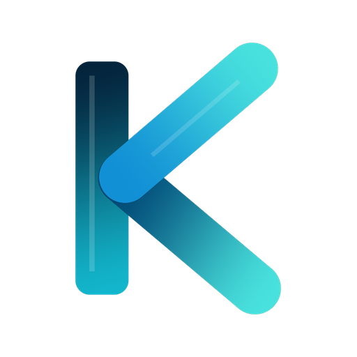
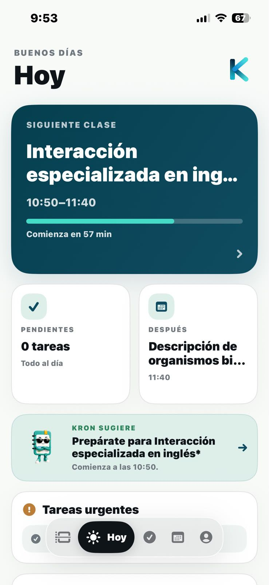
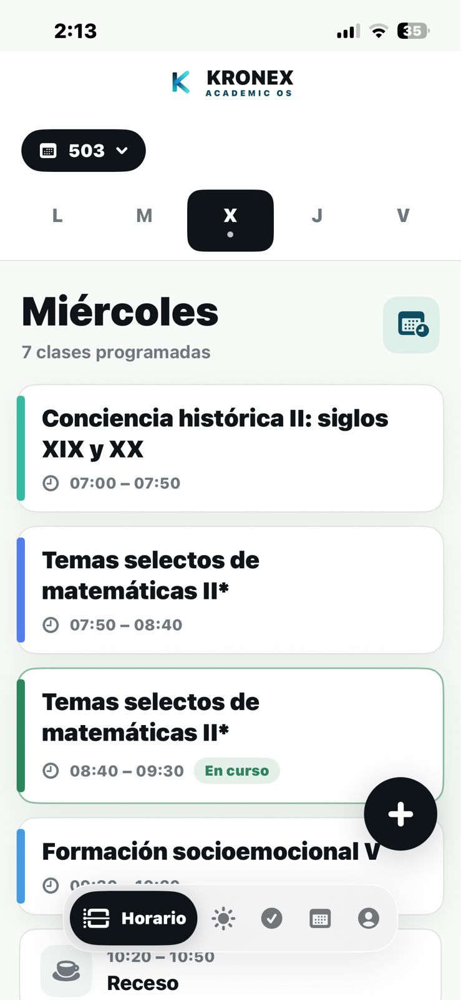
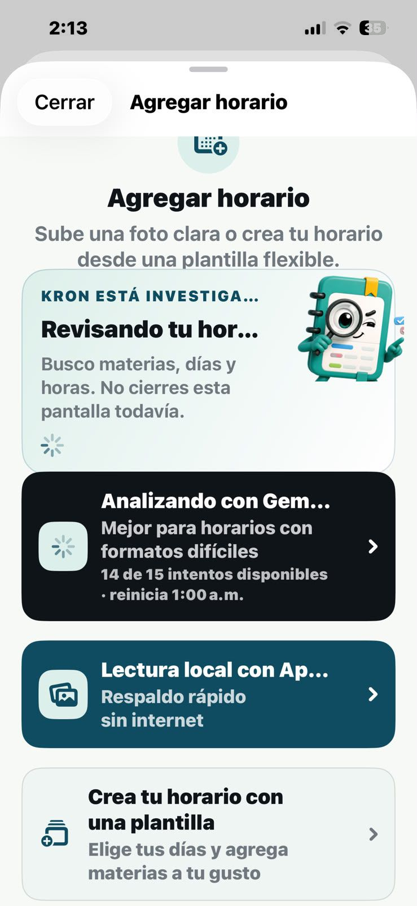
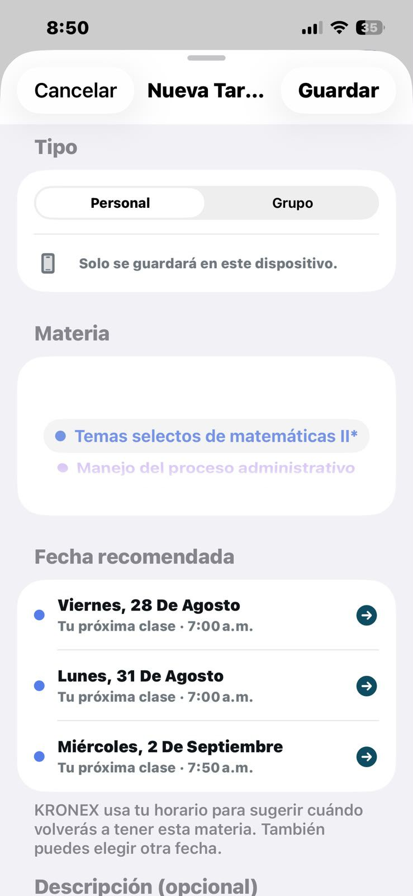
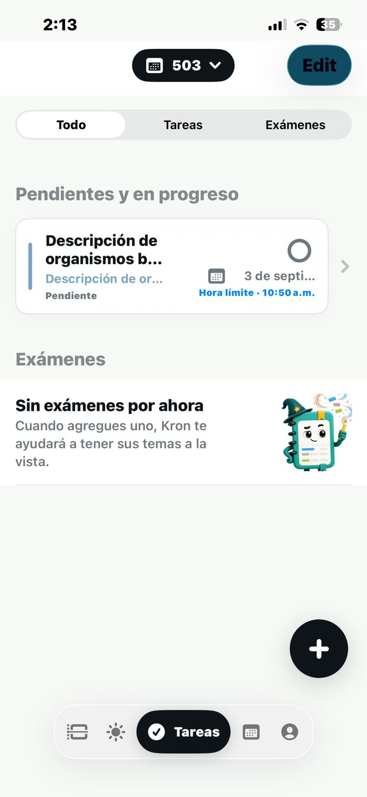
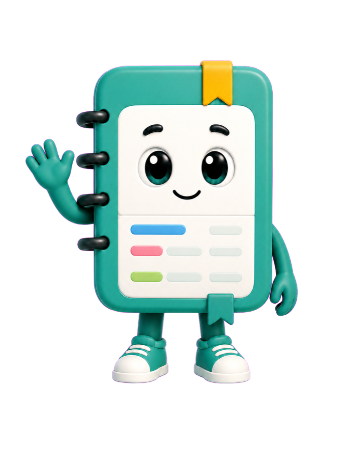

  

  # KRONEX ACADEMIC OS
  ### El sistema operativo académico personal para estudiantes

  
  
  
  

   

  

    <b>Organiza tus horarios, domina tus entregas y sincroniza tu semestre con precisión quirúrgica.</b>
  

  

    
    &nbsp;&nbsp;
    
  

---

## ⚡ ¿Qué es KRONEX?

**KRONEX ACADEMIC OS** no es solo un horario ni una simple lista de tareas: es una plataforma integral diseñada para ser el centro de mando de tu vida académica en la preparatoria o universidad. 

Creado con una estética limpia, minimalista y de alto rendimiento, KRONEX fusiona horarios dinámicos, control de exámenes, escaneo inteligente con IA y trabajo colaborativo en una experiencia fluida y elegante.

---

## 🎯 ¿Qué problema soluciona?

* ❌ **El caos de los horarios en capturas borrosas:** Dejar de buscar en la galería de fotos ese PDF o imagen del horario escolar que nunca encuentras a tiempo entre clases.
* ❌ **Entregas y tareas olvidadas:** Olvidar proyectos porque estaban dispersos entre mensajes de WhatsApp, libretas y correos electrónicos.
* ❌ **Descoordinación en equipos:** La dificultad de compartir horarios y ponerse de acuerdo para tareas grupales o proyectos finales.
* ❌ **Apps complejas o saturadas de anuncios:** Olvídate de aplicaciones lentas, llenas de publicidad invasiva o diseños descuidados.

**Con KRONEX tienes:**
* ✅ Tu próxima clase y tiempo restante siempre visible al instante.
* ✅ Carga de horarios en 5 segundos con **escaneo inteligente por IA**.
* ✅ Fechas de entrega sugeridas automáticamente según los días que realmente tienes esa materia.
* ✅ Privacidad real: tus horarios, tareas personales y notas permanecen guardados en tu dispositivo.

---

## 📱 Experiencia Visual & Funcionalidades

  <table>
    <tr>
      <td width="33%" align="center">
        <b>Tu Día Académico (Vista Hoy)</b>  
         
        Siguiente clase, tiempo restante, tareas del día y consejos de Kron.
      </td>
      <td width="33%" align="center">
        <b>Horario Inteligente Semanal</b>  
         
        Visualización por días, estado «En curso», recesos y tarjetas elegantes.
      </td>
      <td width="33%" align="center">
        <b>Escaneo Inteligente con IA</b>  
         
        Sube una foto de tu horario y la IA extrae materias, días y horas.
      </td>
    </tr>
    <tr>
      <td width="33%" align="center">
        <b>Tareas & Fechas Inteligentes</b>  
         
        KRONEX sugiere fechas límite basadas en tus días de clase reales.
      </td>
      <td width="33%" align="center">
        <b>Control de Entregas & Exámenes</b>  
         
        Seguimiento claro de entregas pendientes, en progreso y exámenes.
      </td>
      <td width="33%" align="center">
        <b>Conoce a Kron</b>  
         
        Tu asistente visual que te acompaña, organiza y guía cada día.
      </td>
    </tr>
  </table>

---

## 🤖 Conoce a Kron — Tu Asistente Académico

En el centro de KRONEX vive **Kron**, una agenda académica viva que actúa como tu copiloto estudiantil:

* **Orientación contextual:** Te indica con cuánta anticipación salir a tu próxima clase o qué temas adelantar cuando tienes tiempo libre.
* **Resumen diario:** Diagnóstico matutino con un solo vistazo para que sepas exactamente cómo viene tu jornada.
* **Estados expresivos:** Atento durante exámenes, enfocado en horario de clases y descansando en fines de semana o vacaciones.

---

## 📥 Cómo instalar el APK en Android (Guía en 3 Pasos)

Instalar la beta de KRONEX toma menos de 1 minuto:

1. **Descarga el APK:**  
   Pulsa en [Descargar APK Oficial](https://github.com/N1CKGZ/kronex-releases/releases/download/v0.5.0-beta10/KronexV1.apk) para guardar `KronexV1.apk` en tu dispositivo.

2. **Permite la instalación:**  
   Si Android te muestra una advertencia preventiva sobre archivos externos, toca en **Configuración** y activa la opción **«Permitir desde esta fuente»** (puedes desactivarla después si lo deseas).

3. **Instala y comienza:**  
   Confirma pulsando en **«Instalar»**, abre KRONEX y configura tu primer horario.

> 🛡️ **Nota de seguridad:** Descarga KRONEX únicamente desde este repositorio oficial o desde [kronexacademic.com](https://kronexacademic.com). El APK oficial está firmado digitalmente y libre de anuncios o componentes invasivos.

---

## 🔒 Integridad del Instalador

| Atributo | Detalle |
| :--- | :--- |
| **Archivo** | `KronexV1.apk` |
| **Versión** | `0.5.0-beta10-dev` |
| **Package ID** | `com.kronexacademic.kronex.dev` |
| **Arquitecturas** | `arm64-v8a`, `armeabi-v7a`, `x86_64` |
| **Requisito mínimo** | Android 8.0 (Oreo) o superior |
| **SHA-256 Checksum** | `78338f1de8fc4fec555a17bbe4f364bf197bb79b97d641a0c8b2cce331822906` |

---

## 💬 Comunidad, Reporte de Errores & Contacto

¿Encontraste un detalle o tienes una idea para mejorar KRONEX?

* 🐛 **Reportar un error:** Abre un reporte directo en [GitHub Issues](https://github.com/N1CKGZ/kronex-releases/issues).
* 🌐 **Sitio Web Oficial:** [kronexacademic.com](https://kronexacademic.com)
* ✉️ **Contacto:** `info@kronexacademic.com`

---

  Desarrollado con dedicación para transformar la vida académica de los estudiantes. 
  © 2026 KRONEX ACADEMIC OS. Todos los derechos reservados.

